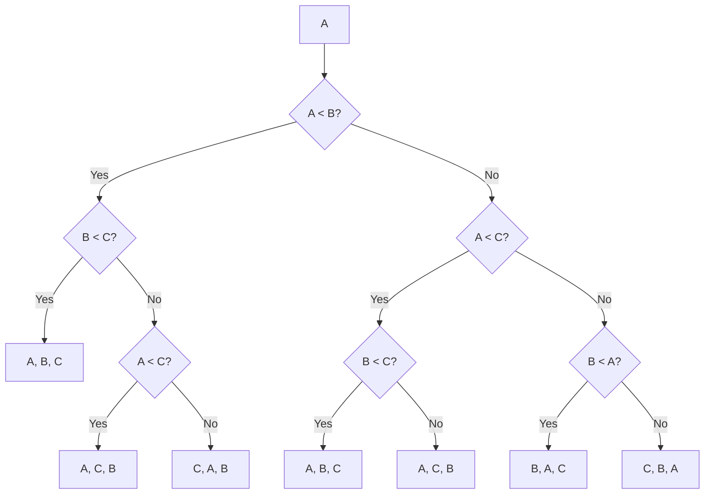

# Analysis
Before we can attempt to solve problems, we must answer 3 important questions about the algorithm
## Is it correct?
This is of the highest importance. An algorithm is simply _wrong_ if it does not produce the correct output for all input. How do we prove correctness? We cannot simply rely on test cases, this isn't "proof" enough as discussed in [Are there computational problems that computers cannot solve?](/blog/are-there-computational-problems-that-computers-cannot-solve). There may be many edge cases it can fail on that remain undiscovered. An inductive proof is far superior to "proof by AC." Only in the case of highly complicated algorithms can we rely on test cases (as it gets more complicated to prove it mathematically.)

There are also probabilistic algorithms that give the correct output _most_ of the time. However, we will cover probabilistic algorithms at a later point in time and focus on deterministic algorithms for now.
## How much time?
How much time? (or any other resource, does it require to compute the solution). Time complexity is usually expressed as an function in terms of input size and underlying model of computation used. Knowing this is important in knowing when and how to feasibly execute an algorithm. If we know an algorithm is $O(2^n)$ there's no point executing it for a very large $n$ as it would take more than our lifetime to compute.   
Note that for computing time complexity, it is very important to fix the underlying model of computation. On a single tape Turing machine, each bit in the number corresponds to an unit of computation. On the other hand, if we think of a modern machine with 64-bit registers and we restrict our integer inputs to $\leq 2^{64}$ then we can model arithmetic as constant time operations. But for a single tape Turing machine, addition would require $O(n)$ time. 
## Can we do better?
We have to see if we can do better, and if not, we must prove the optimality of our current solution. But how do you prove the optimality of a solution? The number of possible "programs" as discussed in [Are there computational problems that computers cannot solve?](/blog/are-there-computational-problems-that-computers-cannot-solve) is countable, but it is still infinite. We cannot attempt to go through all of them individually. To solve this issue, we need to instead build an image of the capabilities of a given model of computation and enforce constraints that allow us to come up with a proof for the same. Remember, time complexity is defined for a fixed model of computation. So we use that as the base and draw implications from there. For example, we know that the lower bound for comparison based sorting is $O(nlog_2(n))$ in the order of comparisons made. How? Let's discuss how we prove this.
### Proving a lower bound of $\Omega(nlog_2(n))$ for comparison based sorting
#### Decision Tree Model
To prove this bound, let's come up with an useful model to visualize / enumerate the number of comparisons based in an arbitrary sorting algorithm. Any comparison based sorting algorithm must perform $x$ number of comparisons to end up with a result. Further, which comparison it makes on the $i^{th}$ iteration depends on the result of the $(i-1)^{th}$ iteration. In short, we can imagine the comparisons made to be a decision tree. Here's what the decision tree would look like for sorting an array of size three. 

Note that every non-leaf node in this diagram represents a comparison, and every leaf-node represents one of the resultant permutations generated by the sort. Every **path** from the root to a leaf node represents a sequence of execution of the sort. No matter in what order the sorting algorithm does the comparisons, it needs to take one of these paths to end up at a leaf node. And since we have this nice model, we can say that the worst case number of comparisons performed will be the height of the tree. If we can prove a lower bound for the height of the tree, we have proved the lower bound for comparison based sorting algorithms. 

Note that for any array of size $n$ (containing unique numbers), there exist $n!$ different ways to order these positions. Every inverse permutation of all possible permutations of $1 \cdots n$ can be an input. This implies that there must be $n!$ leaf nodes, corresponding to every such input permutation. If there are less than $n!$ leaf nodes, we would not be able to solve each of the $n!$ inputs correctly since the solution for that input would not exist in the decision tree. Second, note that the decision tree is a **binary tree**, which implies that if the tree has height $h$, it can have at max $2^h$ leaf nodes. From this, we get
$$
\begin{aligned}
2^h \geq n! \\
h \geq log_2(n!) = log_2(n\cdot(n-1)\cdot(n-2)\cdots1) \\ 
h \geq \sum_{i=1}^nlog_2(i) = \sum_{i=1}^{\frac{n}{2}-1}log_2(i) + \sum_{i=\frac{n}{2}}^nlog_2(i) \\
h \geq 0 + \sum_{i=\frac{n}{2}}^nlog_2(i) \geq \frac{n}{2} \cdot log_2(\frac{n}{2}) \\
\implies \Omega(nlog_2(n))
\end{aligned}
$$
### Alternate method
For any given sequence of $n$ elements, there exist $n!$ permutations in which they can be arranged. The sorting problem requires us to find one such permutation out of all $n!$ permutations such that $a_i < a_{i+1} \ \forall a_{i<n}\in A$ where A is our sequence.

Let's suppose that we can find the sorted array using just $k$ comparisons. This would imply that we can represent permutations $0$ to $(n! - 1)$ using just $k$ bits. To represent $(n! - 1)$ in bits, we need $log(n! - 1)$ bits, therefore $k \geq log(n! - 1) \implies k \geq log(n!)$ bits is required.

> **Why is this true?** We assumed that our algorithm will be able to find the answer to the sorting problem using just $k$ comparisons. If we consider the result of a single comparison, it can have **exactly** 2 values. True or false. If we consider $k$ comparisons, we can have $2^k$ possible results. In essence, each comparison is able to cut **half** of the permutations we need to consider. Each of those $2^k$ results can be used to uniquely identify some permutation. Now, the answer to the sorting problem must be one of the $n!$ possible permutations. For our algorithm to successfully find the right permutation for every given input, it must be able to _at_ _least_ uniquely identify each of the $n!$ possible permutations. This leads us to the conclusion that $2^k \geq n! \implies k \geq log_2(n!)$ bits/operations are required.

$$ 
log(n!) = log(n)+log(n-1)+\dots+ log(\frac{n}{2})+\dots+log(2)+log(1)
$$

Let's discard the bottom half of this sum. The sum we get after discarding the bottom half must be **lesser** than the original sum as all the values are **positive.** This gives the following,

$$ log(n!)\geq log(\frac{n}{2})+log(\frac{n}{2}+1)+\dots+log(n-1)+log(n) $$

By reducing all the terms inside $log$ to just $\frac{n}{2}$, we will only get a sum **lesser** than the above as $log$ is an increasing function. This gives,

$$ log(n!) \geq log(\frac{n}{2})+\dots+log(\frac{n}{2}) \\ log(n!) \geq \frac{n}{2}log(\frac{n}{2}) \\ = \Omega(nlogn) $$

It is also not very difficult to find an **upper bound** to $log(n!)$. Similar to the calculation above,

$$ log(n!) = log(n)+log(n-1)+\dots+log(2)+log(1) $$

Replacing each of the above terms with $log(n)$ will only give us a sum greater than the above one as $log$ is an increasing function. This gives,

$$ log(n!) \leq log(n)+\dots+log(n) \\ log(n!) \leq nlog(n) \\ = \Theta(nlogn) $$
# References
These notes are old and I did not rigorously horde references back then. If some part of this content is your's or you know where it's from then do reach out to me and I'll update it. 
1. Professor [Kannan Srinathan's](https://www.iiit.ac.in/people/faculty/srinathan/) course on Algorithm Analysis & Design in IIIT-H
2. [CLRS, Introduction to Algorithms](https://en.wikipedia.org/wiki/Introduction_to_Algorithms)